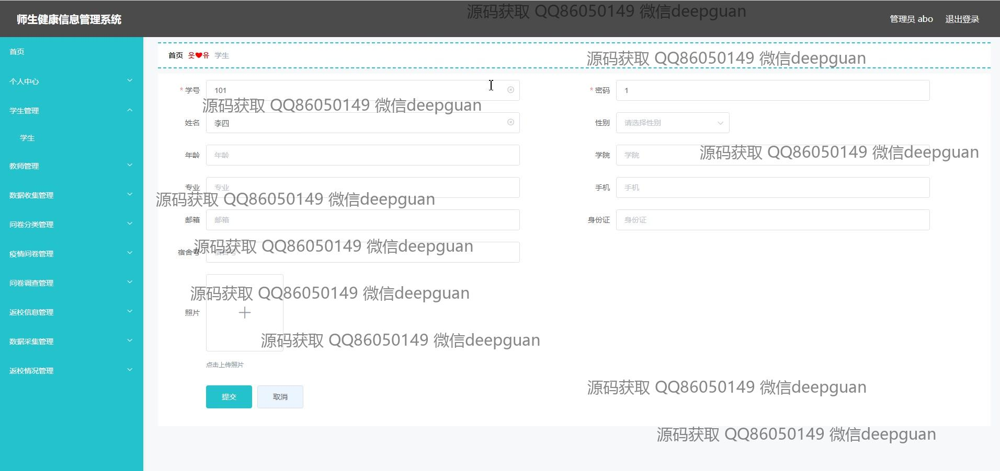
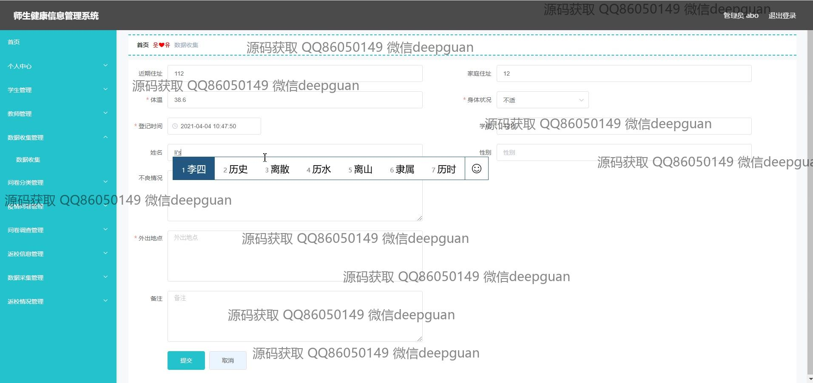
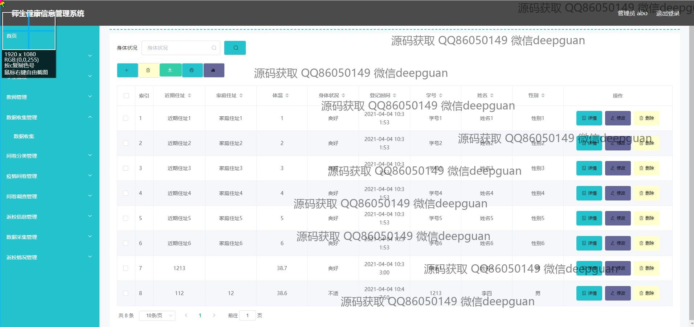
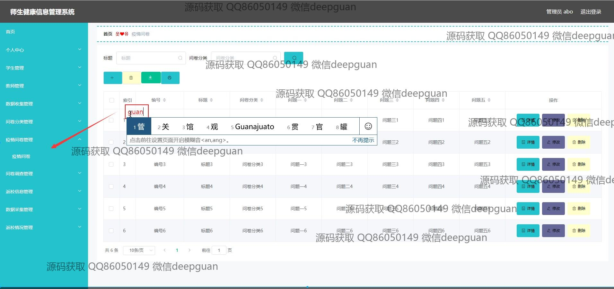
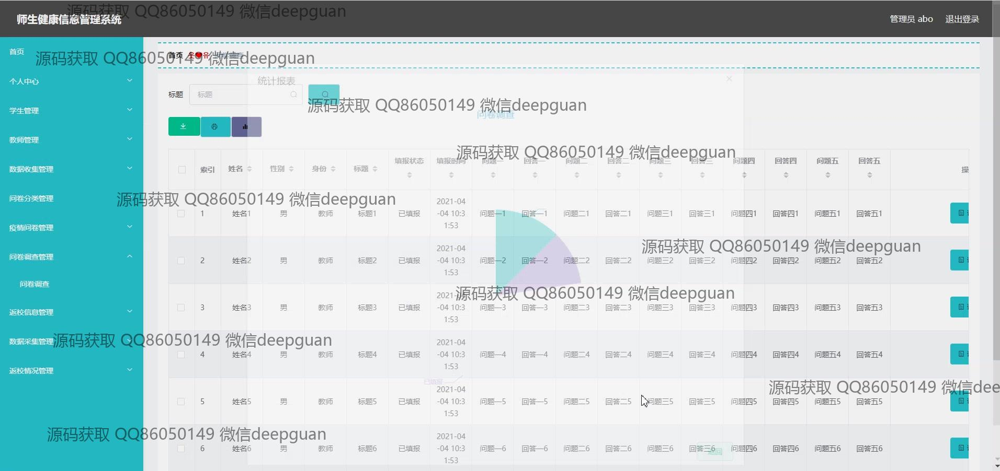
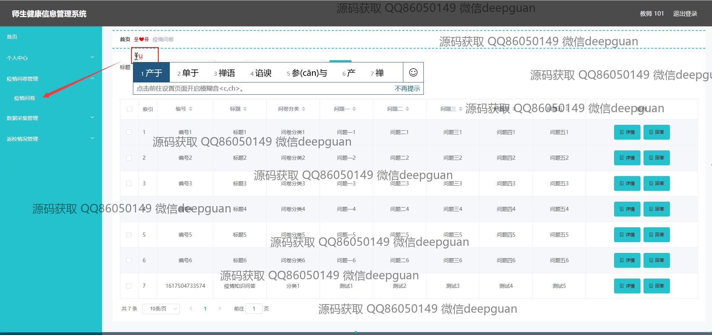

<h1 align="center">师生健康信息管理系统</h1>

## 简介
师生健康信息管理系统：角色分为管理员、学生、教师；功能包括个人中心、学生管理、教师管理、数据收集管理、疫情问卷管理、返校信息管理，旨在高效管理和追踪师生健康数据。    --计算机毕业设计源码；毕设源码；java毕业设计源码

## 联系方式

<h3 align="center">获取完整代码与数据库文件 + 微信：deepguan QQ: 86050149 QQ群: 783742310</h3>

<h3 align="center">可帮忙远程部署 包运行成功！提供远程部署、修改代码、设计文档指导、代码讲解等服务！</h3>

## 功能介绍（完整见运行截图）
管理员：管理员在系统中可以进行用户管理、注册、登录和注销操作，查看和编辑学生与教师的健康信息及个人信息，并提供各类数据统计与分析功能。管理员可以对系统内的各个模块进行全面管理，包括学生管理、教师管理、疫情专门管理、返校信息审核与数据采集等。通过搜索及筛选功能，管理员能够快速定位和处理指定记录，确保信息的完整与准确。同时，管理员可以发布和管理疫情问卷、收集健康数据，并进行问卷统计分析，以辅助校园健康决策。

教师：教师通过系统能够记录和更新个人健康信息、课程相关健康数据和离返校状态，填写并提交健康调查问卷。教师还可以利用数据采集模块跟踪学生的健康状况，输入体温测量、症状描述等信息。系统为教师提供了对个人信息的管理功能，包括密码修改和个人资料的更新。教师可参与和管理有关疫情防控的调查，登录系统查看新闻与通知，接收学校的健康提示和公告。

学生：学生可以使用此系统提交和更新个人健康信息，查看学校发布的健康政策与防疫措施。学生通过登录和注册功能进入系统，在健康问卷模块填写相关调查问卷。系统允许学生管理返校信息、编辑个人健康数据和联系信息，使学校能够进行有效的健康跟踪与管理。学生能够了解自己在疫情管理中的健康状态、体温历史记录，以及遵循的返校指南与要求，保障校园生活的安全。

家长：家长访问系统时，能够查看学生的健康信息和学校要求的健康填报内容。通过代理学生身份，家长可以协助学生完成健康问卷的填写、返校状态的确认与健康跟踪表的维护。这一功能确保了在学生不便操作时，家长能协同学生一起完成信息上报和修改，同时也可以获取有关学校防疫政策和学生在校健康状况的重要信息。家长通过浏览学校公告与新闻，能够及时了解最新的疫情动态和学校应对措施。

## 运行截图

本代码来源于网络,仅供学习参考使用!

